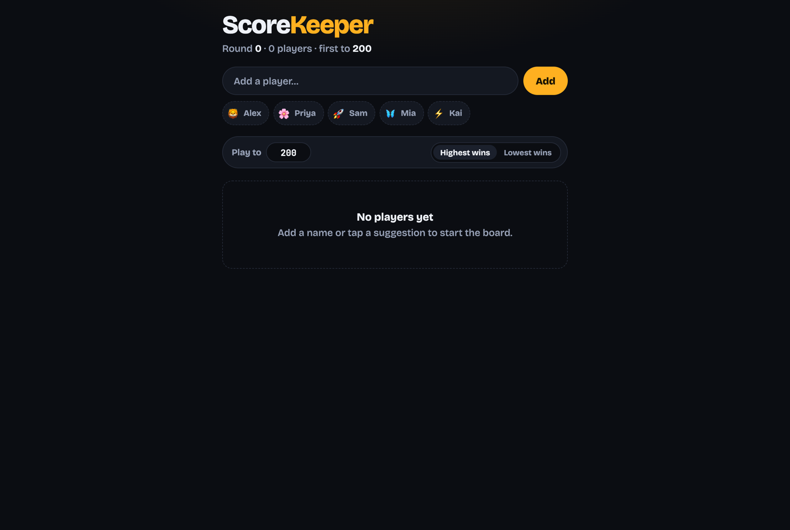

# Score Keeper

A scoreboard for card and board game nights. One HTML file, no build step, no backend,
no accounts. Scores stay in the browser that entered them.


## Why

Paper scoresheets get lost, and a notes app makes you do the adding and the sorting yourself.
Most scoreboard apps want an account, a subscription, or a sign-in for every player at the
table. This one is a single page: open it on a phone, add names, type each round's score, and
the board keeps the running totals in rank order and calls the game when someone hits the target.

## What it does

- **Round-based entry.** Type each player's score for the round and press one button. Cards
  re-sort and slide to their new rank with a FLIP animation instead of snapping.
- **Highest or lowest wins.** A toggle flips the ranking, so it works for Rummy as well as
  Hearts. Tied totals share a rank. Gold, silver and bronze badges mark the top three.
- **Target score.** Defaults to 200; set anything above zero. Each card shows how far the
  player is from it. When any total reaches the target, a game-over screen names the winner
  with confetti and the last-place player with a drooping emoji, and the browser says
  "Losers!" out loud through the Web Speech API. Keep playing or start a new game from there.
- **Emoji avatars.** Every player gets one. Tap it to cycle through eighteen options.
- **Quick-add chips.** Five names are offered under the input; edit the `SUGGESTED` constant
  at the top of the script to make them your regulars.
- **History per player.** The last eight round scores show as chips, negatives in red, with
  the full list on hover when there are more.
- **Persists between visits.** State is saved to `localStorage` under the key `score-keeper`.
  Nothing is sent anywhere.
- **In-app confirmations.** Removing a player or resetting the game uses a styled native
  `<dialog>`, not a browser alert.

## Screenshots

| | |
|---|---|
|  |  |
| Empty | Lowest wins |
|  |  |
| History | Game over |

*Screenshots use the synthetic games generated by `Tools/demo-state.mjs`, not anybody's actual
game night.*

## Quick start

Requires Node 18 or newer. There are no packages to install.

```bash
git clone https://github.com/aaryann123/score-keeper.git
cd score-keeper
npm run dev
```

Open http://127.0.0.1:6161. You can also open `public/index.html` straight from disk; the
dev server is only there for a stable local URL.

To try it with a game already in progress, paste a synthetic state into the browser console:

```bash
node Tools/demo-state.mjs longgame
```

```js
localStorage.setItem("score-keeper", JSON.stringify(<paste the output here>)); location.reload();
```

To host it, `wrangler.jsonc` is set up for Cloudflare Workers static assets:

```bash
npx wrangler login
npm run deploy
```

## Requirements

| | |
|---|---|
| Browser | Any current Chrome, Safari, Firefox or Edge. Uses `<dialog>`, the Web Animations API, and `localStorage`. |
| Node | 18 or newer, only for the dev server and the tools. |
| Fonts | Bricolage Grotesque and JetBrains Mono from Google Fonts; falls back to system fonts offline. |
| Speech | The "Losers!" line needs a speech engine in the browser. Without one the game-over screen is silent. |
| Screenshots | Google Chrome and macOS `sips`, only if you regenerate `docs/screenshots/`. |

## How it's organised

```
public/index.html      the whole app: styles, markup, and script in one file
server.mjs             ten-line node:http dev server, port 6161 or $PORT
wrangler.jsonc         Cloudflare Workers static-assets config
Tools/demo-state.mjs   synthetic game states for demos and screenshots
Tools/screenshots.mjs  headless Chrome over DevTools protocol, regenerates docs/screenshots/
docs/ARCHITECTURE.md   how state, rendering, ranking and the animations work
docs/BUILDING.md       running, deploying, extending, regenerating screenshots
```

## Contributing

Pull requests are welcome.

- The fastest check is `npm run dev` and a click through: add players, enter a round, hit the
  target, remove a player.
- Adding an emoji is one entry in the `EMOJI` array; a new suggested name is one entry in
  `SUGGESTED`.
- Use the synthetic states in `Tools/demo-state.mjs` for screenshots. Never commit a real game.
- Good first projects: an undo for the last round, a per-round table view, and sharing a board
  between phones.

## Credits and licence

Score Keeper is MIT licensed, see LICENSE.

- [Bricolage Grotesque](https://github.com/ateliertriay/bricolage) by Mathieu Triay and
  [JetBrains Mono](https://www.jetbrains.com/lp/mono/) by JetBrains, both under the
  [SIL Open Font License 1.1](https://openfontlicense.org/).
